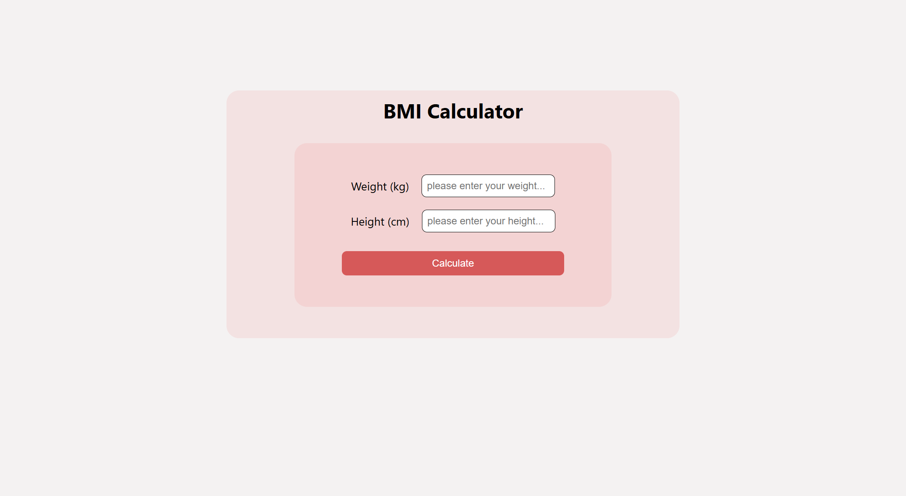

# BMI Calculator 💪 | React.js

A simple and responsive **Body Mass Index (BMI) Calculator** built using **React.js**. This app allows users to input their weight and height to calculate their BMI and determine their health status.

## 🚀 Features
- ✅ User-friendly and interactive UI  
- ✅ Supports both metric (kg/cm) 
- ✅ Real-time BMI calculation and classification  
- ✅ Responsive design for all devices  
- ✅ Built with **React.js** and styled with **CSS**  

## 🛠 Tech Stack
- **React.js** (Frontend)  
- **CSS** (Styling)  

## 📸 Preview
  

## 🎯 How to Use
1. Clone the repository:  
   ```bash
   git clone https://github.com/Pankaj352/BMI-Calculator.git
   cd BMI-Calculator
   ```
2. Install dependencies:  
   ```bash
   npm install
   ```
3. Start the app:  
   ```bash
   npm start
   ```

## 📏 BMI Categories  
| BMI Range         | Category         |
|-------------------|-----------------|
| Below 18.5       | Underweight      |
| 18.5 – 24.9      | Normal Weight    |
| 25.0 – 29.9      | Overweight       |
| 30.0 and Above   | Obesity          |

## 💡 Contribution
Contributions are welcome! Feel free to fork the repo, open issues, or submit pull requests to enhance the project.

## 🔗 Live Demo  
[Click here to check out the live demo](https://bmi-calculator-lac-beta.vercel.app/)  

---

🌟 **If you found this project useful, don't forget to give it a star!**  
📩 **Connect with me on [LinkedIn](https://www.linkedin.com/in/pankaj-maurya-7a9172228/)**  
